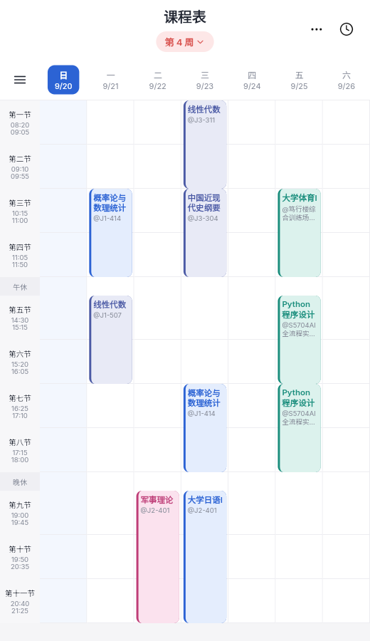

# 广应课课表

仿照移动端课程表 App 的界面，用 **Flutter + forui 0.26** 实现。
课表数据从**正方教务系统**（`xskb/xskb_list.do`）实时拉取，**不做任何本地缓存**；
只有「用户自己添加的课程」与几项本机设置（账户、提醒、保活）会落盘 —— 那是用户数据，不是缓存。
桌面小组件另有一份原生侧存的「接下来几节课」快照（只是显示缓存，随每次推送覆盖）。
Web 端只依赖一个本地网关即可绕过浏览器跨域与 Cookie 限制。

应用显示名（启动器 / 浏览器标签 / 窗口标题）统一为 **广应课课表**，
图标是「蓝底 + 白色读书剪影」，图标怎么改见[应用图标与名称](#应用图标与名称)。



> 上图是 `dart run tool/jw_proxy.dart` 起网关后，用无头 Edge 打开 `http://127.0.0.1:8765/` 截的真实画面：
> 数据来自学校教务系统（第 4 周），不是 mock。


## 四个页面（底部导航）

页面底部是主导航，四个 Tab 各自是完整页面：

| Tab | 内容 | 数据来源 |
| --- | --- | --- |
| **课表** | 周次胶囊、日期条、节次网格、课程卡片、菜单/今日课程 | `xskb/xskb_list.do`（按周次 POST） |
| **空教室** | 蓝色头部（校区/教学楼 chips + 日期条）+ 教室占用一览（红绿小条），点教室看当天每节课的上课班级 | `kbcx/kbxx_classroom_ifr`（按周次 + 星期 POST） |
| **我的信息** | 姓名、学号、院系、专业、班级 + 「登录教务系统」入口 + 应用信息 | 主页面 `xsMain_new_*.jsp`（**和当前周次同一个响应，零额外请求**）；登录走 `verifycode.servlet` + `xk/LoginToXk` |
| **选课** | 学生选课中心的轮次列表（学年学期 / 选课名称 / 选课时间 / 轮次 id） | `xsxk/xklc_list` |

- 「选课」页目前**只读**：只读取轮次，不替你提交选课志愿（避免误改选课结果）。要真正提交选课需要重做那套复杂的选课 UI，需要的话再说。
- 「空教室」页同样**只读**：只查占用情况，不会预约、借用任何教室。
  条件分两档 —— **日期 / 校区 / 教学楼**会重新联网（日期条把「周次 + 星期」合成了一颗 chip，
  今天起往后两周任选）；**节次不再单独筛选**，而是画进列表：每间教室一行，
  右侧把每个节次的占用画成红绿小条（绿 = 空闲、红 = 占用，按上午 / 下午 / 晚上 分组）。
  **点任意一间教室**弹出底部详情，按节次列出它这天的上课班级（课程 / 教师）与空闲时段 ——
  「这间教室第 3-4 节谁在上课」就是这么查的。
- Web 端可以直接用 hash 打开指定页面：`http://127.0.0.1:8765/#classroom`、`#profile`、`#selection`（也方便截图与分享）。
- 实测这两页的当前状态：主页面给出姓名「张三 / 202600000001 / 信息学院 / 软件工程/ 26软件工程2班」；
  选课中心返回「未查询到数据」——即当前没有开放轮次（选课一般在学期初开放）。

## 上课提醒

设置页（右上角 `⋯` → 设置）里的「上课提醒」：**总开关** + **提前多久**（5/10/15/20/30/45/60 分钟，
默认**开着**、默认提前 **10 分钟**）。到点由系统发通知，标题写「还有 N 分钟上课」，
正文写「课程名 · 教室 · 08:20-09:55」。

分三层，每层都能单独测：

| 层 | 文件 | 职责 |
| --- | --- | --- |
| 排期（纯函数） | `state/reminder_planner.dart` | 学期 + 周次课表 + 提前量 → 每条提醒的**触发时刻**与文案 |
| 投递 | `data/class_notifier{,_io,_stub}.dart` | 交给操作系统（Android/iOS/macOS 真发；Web 退化成「不支持」） |
| 设置持久化 | `data/reminder_store.dart` | 开关与提前量落盘（`shared_preferences`） |

## 保活（开机自启 + 耗电限制指引）

上课提醒靠系统闹钟在后台准点响，被系统「杀后台」是提醒不响的头号原因。
设置页里的**「保活」**栏目收两件事：

- **开机自启**：App 里的开关只**记录用户意愿**并落盘（真正的开关在系统里，
  国产 ROM 的自启动管理没有公开 API）——打开时会顺手把用户带到系统的自启动管理页
  （小米/华为/OPPO/vivo/三星/魅族按机型逐个试已知入口，全失败退回应用详情页）。
- **后台耗电限制取消指引**：底部弹层的分步指引（自启动 → 电池优化白名单 → 锁定后台），
  带三个跳转入口：「申请跳过电池优化」（弹系统确认框）、「打开电池优化列表」、「应用详情页」，
  并实时显示当前是否已在白名单里。

| 层 | 文件 | 职责 |
| --- | --- | --- |
| 模型 | `models/keep_alive.dart` | `KeepAliveSettings`（目前只有开机自启意愿），JSON 走来回、坏数据退默认 |
| 平台口 | `data/keep_alive_platform{,_io,_stub}.dart` | MethodChannel `keep_alive`（Android 真跳转/查询；Web 退化成「不支持」） |
| 持久化 | `data/keep_alive_store.dart` | 落盘（`shared_preferences`，key `keep_alive_v1`），读写都不抛异常 |
| 原生 | `MainActivity.kt` | 跳自启动管理/电池优化页、查/申请电池优化白名单（`REQUEST_IGNORE_BATTERY_OPTIMIZATIONS` 权限） |
| 界面 | `widgets/keep_alive_sheet.dart` | 保活指引弹层（`ListenableBuilder` 跟着控制器状态重画） |

几个刻意的设计：

- **App 不假装能改系统设置**：开关只存意愿 + 带路，提示文案里明说「还需在系统里放行」，
  不做「假开关」。
- **电池优化状态启动时查一次**（只查不弹框），申请回来后再刷新一次，
  指引里的状态卡片如实反映「已放行 / 尚未放行 / 查询中」。
- **不支持的平台（Web）整栏降级成一句说明**，与上课提醒的降级方式一致。

## 「下一节课」桌面小组件

长按桌面空白处 → 小组件 → 广应课课表，把 **「下一节课」** 拖到桌面（2×1，深色圆角卡片）：

- 有课：显示 **「下一节课 / 正在上课」** + 课程名、时刻与节次、地点教师，点卡片打开应用；
- 没课（含假期）：显示 **「没有课了 可以放心玩了！」**。

| 部分 | 文件 | 说明 |
| --- | --- | --- |
| 条目计算 | `models/next_class.dart` | 把接下来 3 天的课换算成带真实时间戳的 `NextClassEntry`（自建课与教务课都在内） |
| 投递口 | `data/widget_updater{,_io,_stub}.dart` | MethodChannel `next_class_widget`（Android 真推；其余平台空操作），读写都不抛异常 |
| 原生小组件 | `android/.../NextClassWidgetProvider.kt` + `res/layout/next_class_widget.xml` + `res/xml/next_class_widget_info.xml` | RemoteViews 按「当前时间」挑一条显示；点卡片拉起应用 |

几个刻意的设计：

- **小组件不碰教务、不联网**：数据由 App 内算好（含周次→日期换算）推过去，原生只存一份
  JSON（SharedPreferences `next_class_widget`）并按时间挑条目，逻辑归 App、显示归原生。
- **刷新分三层**：课表变化（拉到数据 / 加删改自建课 / 退出登录 / 学期设置变化）→ App 立刻推；
  节次边界（开课 / 下课）→ 原生用 `setExactAndAllowWhileIdle` 定的闹钟精准换内容
  （没精确闹钟权限就退化为不精确）；最后系统每 30 分钟一拍的 `updatePeriodMillis` 兜底。
- **只看未来 3 天**：再远「下一节」没有意义；三天内都没课（比如放假）就如实显示「没有课了」。
- **推送失败完全静默**：小组件维持旧显示，绝不影响课表页主流程。

几个刻意的设计（改动前先看这段，都是踩过的点）：

- **提醒由课表推导，不是「每天定点响」**：一门课只在第 4-18 周、周一的第 1-2 节上，
  提醒就跟着这个具体时刻走。同一节课的**通知 id 固定**
  （`周次 × 1000 + 星期 × 100 + 起始节次`），重排时精确覆盖，不会攒出一堆重复提醒。
- **覆盖式重排**：每次拿到新课表就「先清空已排的、再全量排一遍」。课表随时可能被教务系统改
  （换教室、停课、换老师），增量排期会留下对不上的旧提醒。
- **但内容没变就绝不碰系统闹钟**：一次重排要「清空 + 逐条排」几十次平台调用，所以控制器里先比
  「排期签名」（每条提醒的 id + 时刻 + 标题 + 正文），一样就直接返回 —— 来回切周时不会反复折腾闹钟。
- **不补发已经过去的提醒**：如果用户在上课前 3 分钟才打开 App、而提前量是 10 分钟，
  这门课**不提醒**。每次冷启动都补弹一串「该上课了」比不提醒更烦。
- **权限和开关是两件事**：用户拒了通知权限，开关**保持打开**（那是他的意愿，不该被偷偷拨回去），
  界面在下面给一条「系统还没放行通知权限」+「去设置」的提示。
- **精确闹钟拿不到就退化**：Android 12+ 的 `SCHEDULE_EXACT_ALARM` 要在系统设置里单独放行，
  拿不到时排期退化成不精确（可能晚几分钟），而不是干脆不提醒。
- **异步结果晚到不再崩**：排期是异步的，可能在页面销毁后才回来，所以
  `ScheduleController` 把 `notifyListeners()` 包了一层「已 dispose 就丢掉」的防护。

平台与限制：

- **Android**：`POST_NOTIFICATIONS`（13+ 运行时申请）、`SCHEDULE_EXACT_ALARM`、
  `RECEIVE_BOOT_COMPLETED` 三条权限，以及两个接收器（重启后重新登记已排的提醒）都写在
  `android/app/src/main/AndroidManifest.xml`。首次启动会**主动申请一次**通知权限 ——
  课表 App 的提醒是核心功能，默认开着却要用户自己翻到设置页打开一次才算数，等于默认没开。
- **iOS / macOS**：初始化参数已配好（`lib/data/class_notifier_io.dart`），但 `Info.plist`
  与真机验证还没做。
- **Web / 桌面**：不做系统级定时通知（浏览器关掉页面就提醒不了），设置页会如实写「当前平台不支持系统通知」。
- **排期窗口 = 手上的课表**：课表**不落盘**，冷启动只有「当前周 + 相邻周」，所以每次打开 App
  只排到未来两周。**三周以上不打开 App，第三周之后就没有提醒了** —— 这是「课表不缓存」的代价，
  想彻底解决得把课表落盘（那就得放弃「没有任何本地缓存」这条线）。
- 设置页顺带显示**已排几条**与**最近一条是什么时候**，所以「到底有没有排上」当场可验。

## 自己添加的课程

课表右下角有一个圆形 **+**：教务系统里没有的课（自习、社团、临时调课）也能放进课表。

点开是表单 —— 课程名（必填）、地点、教师、星期、节次（起-止）、周次（起-止），
保存后立刻出现在网格上。**点自己加的课**，详情里会多一个「编辑这门课」，
进去能改，也能两步确认后删掉。教务系统拉回来的课**没有**这个入口：它下次刷新就被覆盖了，
让用户去改只会骗人。

| 层 | 文件 | 职责 |
| --- | --- | --- |
| 模型 | `models/custom_course.dart` | 一条自建课程 + JSON 往返（含越界钳制） |
| 存储 | `data/custom_course_store.dart` | 落盘（`shared_preferences`，key `custom_courses_v1`），读写都不抛异常 |
| 表单 | `widgets/course_form.dart` | 底部弹层：新建 / 编辑 / 删除 |
| 入口 | `screens/timetable_screen.dart` | 右下角圆形加号 |

几个刻意的设计：

- **自建课程是「用户数据」，不是缓存**，所以它和教务课表**分开对待**：**刷新课表、换账号、
  退出登录都不会动它**（`_dropRemoteData` 只清教务侧的数据）。这也是全项目唯一跨会话保留的
  课表数据 —— 其余每周数据都只活在内存里。
- **两个来源在同一处合流**：`ScheduleController.sessionsOfWeek` 把教务课 + 该项生效的自建课
  拼成一个 `List<CourseSession>`，界面只认一套模型 —— 于是网格、今日课程、课时统计、
  **上课提醒**都自动把自建课程算进去。靠 `CourseSession.customId` 区分「这条能不能改」。
- **自己加的课也会排上课提醒**：`_applyReminders` 把自建课程按它覆盖的周次摊开，
  和教务课一起交给 planner（所以一门教务课都没拉到、纯手工课表也有提醒）。
- **坏输入就地纠正，而不是报错**：表单里星期钳到 1-7、节次钳到 1-11（= 节次表长度）、
  周次钳到 1-30，起止给反了自动摆正；存档里的越界字段同样处理，只有「连名字都没有」才整条丢掉 ——
  存档是用户自己敲的，宁可修好一条也不要整份作废。
- **保存 / 删除立刻写盘**，不等退出；写盘失败只记日志（存不上只是「下次打开少了几门课」，
  不该把 App 顶掉）。
- 只有自建课程能被编辑：**界面不去猜「这条是不是手工加的」**，而是直接读
  `CourseSession.customId`（`Course.isCustom`）。

## 技术选型

- **forui 0.26 负责"应用外壳"**：`FTheme`、`FScaffold` + `FHeader.nested`、`FTile`/`FTileGroup`、`FSwitch`、
  `FPopover`、`showFSheet`、`FButton`、`FLucideIcons`（自带图标字体）。
- **课表网格自绘**：`GridMetrics` 把节次换算成像素位置，`Stack` + `Positioned` 精确排布，
  时间轴与课程块严格对齐（含午休分隔行 —— 上下各压一条线，夹成完整的一条分隔带），有几何测试兜底。
  课程卡片在自己的格子里上下各让半个 `blockGap`，所以相邻两节课之间始终留有空隙，不会粘成一片。
- **网格随字号缩放**：`TimetableScale` 从 `MediaQuery.textScaler`（系统字号设置）取出缩放系数，
  按它换算节次行高、时间轴宽度、卡片留白与间距 —— 字放大时格子一起放大，不会被固定尺寸的格子裁掉。
  系数限幅在 `0.85 ~ 1.6`；横向的列内边距（`columnInset`）与表头左右留白刻意不缩放，
  因为列宽是屏幕宽度天平分出来的，跟着放大只会挤掉课程名。
- **数据层**：`dart:io` 的 `HttpClient`（省掉 `http` 包）+ 正则解析（省掉 `html` 包）；Web 端用 `package:web` 的
  `window.fetch`。状态管理只用 `ChangeNotifier` + `InheritedNotifier`。

## 数据来源

### 1）教务系统（默认）

- **课表接口**：`POST https://jw.educationgroup.cn/gzasc_jsxsd/xskb/xskb_list.do`（「学期理论课表」页面自己提交的地址）
- **表单**：`jx0404id=&cj0701id=&zc=<周次>&demo=&sfFD=1` —— `zc` 就是周次（例如第 4 周发 `zc=4`）
- **请求头**：会话（见下）、`User-Agent`、`Referer`、`X-Requested-With: XMLHttpRequest`
- **响应**：UTF-8 的课表 HTML（`<table id="kbtable">`），行是节次块
  （第一二节 / 第三四节 / 第五六节 / 第七八节 / 第九十十一节），列是星期一到星期日；
  会话失效时**不返回页面，返回 JSON** `{"flag1":2,"msgContent":"请先登录系统"}`，代码会翻成可读提示
- **周次接口**：`GET .../framework/xsMain_new_13657.jsp?t1=1`
  → 页面里 `#li_showWeek` 写着「第 4 周/20 周」，这是**当前周次与总周数的权威来源**，
  用它自动校准开学日期；同一份页面里还有**学生信息**（姓名/学号/院系/专业/班级），
  所以「我的信息」页不需要额外请求（模板号不同学校可能不一样，改 `jw_credentials.dart` 的
  `jwMainPagePath` 或用 `--dart-define=JW_MAIN_PAGE=...`）
- **选课接口**：`GET .../xsxk/xklc_list` → 学生选课中心的轮次表（`#tbKxkc`），
  没开放轮次时返回「未查询到数据」（路径可用 `--dart-define=JW_SELECTION_PAGE=...` 覆盖）
- **教室查询接口**：`POST .../kbcx/kbxx_classroom_ifr`
- **表单**：`xqid=<校区>&jzwid=<教学楼>&skjsid=&skjs=&zc1=<周次>&zc2=<周次>&skxq1=<星期>&skxq2=<星期>&jc1=&jc2=`
  （`zc1/zc2` 两端填同一个周次 = 只看这一周；`jc1/jc2` 固定留空 = 全天，节次筛选在本地做）
- **响应**：一张教室占用表 —— **一行一间教室，一列一个「大节」**（第 1-2 节、第 3-4 节…），
  格子里有内容 = 这节课被占用，空格 = 空闲；表头两行写星期几与节次，页面里还有校区/教学楼的 `<select>` 选项
  （路径可用 `--dart-define=JW_CLASSROOM_PAGE=...` 覆盖）
- **解析方式**（`JwClassroomParser`）：**不硬编码列位** —— 先把表格按 `rowspan`/`colspan` 摊平成规整网格，
  再从**表头文字**反推每一列属于星期几、哪几节（`<th>` 还是 `<td>` 都认），没写星期/节次的列按表头文字
  收进 `JwClassroom.extras`（例如「容量」）。只有节次表头整个缺失时才退到「一天 6 个大节」的兜底排法。
  不同学校的模板列数、列序不一样，这套写法都能吃下。

字段映射（格子正文形如
`线性代数<br/><font title='老师'>王可芸</font><br/><font title='周次(节次)'>4-18(周)[01-02节]</font><br/><font title='教室'>J3-311</font>`）：

| 教务系统字段 | 应用模型 |
| --- | --- |
| 格子第一段文字（`<br/>` 之前） | `Course.name` |
| `教室` | `Course.location` |
| `老师` | `Course.teacher` |
| `周次(节次)` 里的 `4-18(周)` | `CourseSession.startWeek` / `endWeek` |
| `周次(节次)` 里的 `[01-02节]` | `CourseSession.startPeriod` / `endPeriod` |
| 格子所在列 | `CourseSession.weekday` |
| 主页面「第 N 周/20 周」 | `Term.startDate`（反推）、`Term.totalWeeks` |
| （接口**不返回**学分 / 课程属性） | `Course.credits` / `Course.category` 为空 |

> 与旧的 `framework/main_index_loadkb.jsp` 相比：**多了老师，少了学分与课程属性**，
> 而且周次从「这一周」变成了「4-18 周」这样的区间（教务系统按 `zc` 已经把结果筛成这一周有课的，
> 本地再按「至少包含请求的这一周」兜一层，见 `ScheduleController._fetch`）。

### 周次口径（重要，别被"差一周"迷惑）

- **教务系统按「周一到周日」分周**：主页面给出的「当前第 N 周」指的是今天所在的那个周一为起点的周。
- **本应用按设计稿「周日到周六」分周**（表头 日→六）。
- 两者对**周一到周六是同一个周次编号**，只有**周日会差 1**。
  实测（2026-09-20 周日）：主页面说**第 3 周**，而应用显示**第 4 周**——两者都对。
- 校准公式：`开学日期（第 1 周周日） = 今天所在周的周一 − (教务系统周次 − 1) × 7 − 1 天`。
  实测代入主页面第 3 周 → **2026-08-30**，与设计稿/示例数据完全一致，说明本地周次与教务系统是对齐的。
- 为什么"今天看第 4 周"才是对的：第 3 周（9/14~9/20）课表**一条课都没有**，第 4 周（9/21 起）才是本学期第一周有课——
  如果直接显示教务系统的 3，今天会看到一张空课表。
- 总周数**只认主页面**：课表接口（`xskb_list.do`）只有一个 1~30 的周次下拉，那是「能选的范围」而不是学期长度，
  不能再像旧接口那样从课表页兜底 —— 主页面读不到时保持设置页里的值。
- 已知限制：周日的课归属——教务系统把周日算在**上一个**周次，本应用把周日画在当前周的**第一列**。
  本校周日无课所以无差异；若你的学校周日有课，告诉我，我按"周日列取上一周数据"来合并。

解析这块有四个坑（代码里都注明在 `lib/data/jw_client.dart`）：

1. 每个格子里有**两个**课程 div：`class="kbcontent1"` 是页面上显示的精简版（没老师、没节次），
   `class="kbcontent"` 才是完整版，后面还跟着一堆 `class="kbcontent sykb2"` 的空 div（切换「实验课表」用）——
   只认完整版且非空的；
2. 星期几由 `<td>` 的**位置**决定（第一个就是星期一），不看 div 的 id（那个 id 每行都会重复）；
3. 节次在正文里是 `[01-02节]`（也可能 `[09-10-11节]`），读不出来时用行首的「第一二节」兜底；
4. 「备注」行里的课（如「劳动教育 8-11周」）没有星期与节次，落不到网格上，直接忽略。

周次换算：课表按**教务系统周次**直接请求（`zc=N`），所以不再依赖本地推算的开学日期；
开学日期只用来把周次画成日期列。若教务系统周次与本地不一致，设置页会显示「教务系统周次」，
可用「开学日期」整体平移校准。

### 2）会话 Cookie

**仓库里不放任何会话**：`lib/data/jw_credentials.dart` 只存教务系统地址与接口路径，会话一律在运行时获得。
原因很直接 —— 这个文件会被编进产物（APK 的 `libapp.so`、Web 的 `main.dart.js`），
在里面写死会话等于把账号贴进安装包。

- **日常用**：在 App 里登录（见下一节），会话只活在内存里，关掉 App 即失效；
- **本地调试想预置会话**：用构建参数注入，值既不入库也不进包
  ```powershell
  flutter run --dart-define=JW_COOKIE="JSESSIONID=...; HWWAFSESID=..."
  ```

> ⚠️ **Web 端一定要把会话交给网关持有**：Web 的 JS 是明文，谁打开页面都能翻到会话。
> ```powershell
> flutter build web --release --dart-define=JW_COOKIE=      # 包体里不放会话
> dart run tool/jw_proxy.dart --cookie "JSESSIONID=..."      # 会话只留在网关进程里
> ```
> 此时 App 不带会话，网关会自动补上。

### 3）在 App 里登录（不用再改代码重新打包）

会话过期以前只能改 `jw_credentials.dart` 重新打包，现在可以直接在
**「我的信息」→ 学生卡片里的「登录教务系统」** 输入学号密码换一份新会话。

流程（`lib/data/jw_login.dart` + `lib/data/jw_http.dart`）：

1. `GET verifycode.servlet` → 拿一张 80×40 的验证码图片，**同时拿到临时 `JSESSIONID`**
   （验证码是绑在会话上的，提交时必须带回去，所以这一步的 Cookie 要留着）；
2. 用户填账号、密码、验证码；
3. `POST xk/LoginToXk`，表单四个字段：

   | 字段 | 值 |
   | --- | --- |
   | `userAccount` | 账号 |
   | `userPassword` | **空** —— 登录页的 JS 在提交前把密码框清空了，真密码只走 `encoded` |
   | `RANDOMCODE` | 验证码 |
   | `encoded` | `base64(账号) + "%%%" + base64(密码)`（对应页面里的 `encodeInp`） |

   `encoded` 里含 `+` `/` `=`，必须 URL 编码 —— 否则原文的 `+` 到了服务端会变成空格，
   这也是最初直接 POST 被 WAF 打成 404 的原因。

4. **成败的判据不是登录接口的响应体**：它可能是跳转页，也可能被 WAF 改写。
   唯一可靠的判据是「拿着新会话读主页面能不能读通」—— 而主页面本来就是登录后立刻要显示的
   内容（学生信息 + 当前周次），所以这次请求不白跑。读通了 → 用响应里 `Set-Cookie` 的新会话
   替换 `client.cookie`，并清掉内存里属于旧会话的课表；读不通 → 用登录页 `#showMsg` 写的原因
   （例如「验证码错误!!」）报错，并把会话回滚成原来的。

   > **跳转得自己跟，不能交给 `HttpClient`**：`dart:io` 的 `HttpClient` 只对 `GET`/`HEAD`
   > 自动跟随 30x，`POST` **只认 303**（SDK 里 `_HttpClientResponse.isRedirect` 的判定）。
   > 教务系统登录成功恰恰是 POST → **302** 跳到主页面，交给它跟等于把 302 原样交回来 ——
   > 界面上的表现就是明明账号密码都对，却提示「教务系统返回 HTTP 302」。而且新会话只写在
   > **那条 302 响应**的 `Set-Cookie` 里，就算它肯跟，跟完之后拿到的也是最后一跳的响应头。
   > 所以 `jw_transport_io.dart` 的 `sendDetailed` 关掉自动跟随，自己逐跳读 `Location` 与
   > `Set-Cookie`（Cookie 累积合并、同名新的覆盖旧的），30x 之后按浏览器语义降级成 GET
   > （只有 307/308 保留原方法和正文）。

几个必须知道的限制：

- **验证码是一次性的**：提交失败那张就被服务端作废了。**失败后界面会自动换一张新图并清空验证码输入框，
  同时保留失败原因**，用户改完密码直接重输即可 —— 不用自己点「换一张」，也不会拿着一张死图反复试，
  把「验证码错了」误读成「密码怎么改都不对」。若换图本身也失败，只把验证码位退化成「点此获取」，
  **不覆盖登录失败的原因**（「密码错了」比「验证码没取到」更该先被看到）。
- **记住密码是可选项**：登录页有「记住密码」勾选框 —— 勾上并登录成功后，密码与账户信息
  一起落进本机应用私有空间（下次打开登录页免输密码，**验证码仍要输**，教务系统的一次性
  验证码让「拿密码自动重登」根本不成立）；不勾就完全不落盘，且会把之前记住的密码抹掉。
- **退出登录会清掉一切**：会话、学号、学生信息快照与记住的密码一并清空。
- **Web 端不支持**：浏览器读不到教务系统下发的 `Set-Cookie`（跨域响应整个不可读），
  而且教务系统给的 Cookie 是 `Path=/gzasc_jsxsd`，浏览器不会把它带到网关的 `/jw/...` 上。
  Web 端仍然用 `dart run tool/jw_proxy.dart --cookie=...` 让网关持有会话。

### 4）学期兜底值

课表数据只有教务系统一个来源，没有本地示例数据源。

`lib/state/schedule_controller.dart` 里的 `defaultTerm`（2026-08-30 起、20 周）只是
**联网返回之前那一瞬间**以及断网时的兜底；启动后 `syncTermWithServer()` 会用主页面上的
「第 N 周 / 共 N 周」反推出真实开学日期并覆盖它，所以换学期、甚至本地这个值是错的，
都会被自动纠正（见 `test/jw_week_info_test.dart`）。

## Web 端跨域：同源网关

浏览器有两条硬限制，**任何纯前端方案都绕不过去**：

1. JS 不能设置 `Cookie` 请求头（浏览器禁止头），所以无法把会话传给教务系统；
2. 跨域响应读不到（教务系统不会返回 `Access-Control-Allow-Origin`），`fetch` 即使发出去也拿不到内容。

所以 Web 端走**同源反向代理**：`tool/jw_proxy.dart` 把「静态托管 Web 产物」和「反代教务系统」合成一个服务，
浏览器只跟 `127.0.0.1` 打交道，**完全不涉及 CORS**：

```
浏览器 ──POST /jw/xskb/xskb_list.do──▶ 本地网关 ──Cookie: 真会话──▶ 教务系统
        （同源，带自定义头 X-JW-Cookie）            （翻译请求头 + 60s 响应缓存）
```

```powershell
flutter build web --release
dart run tool/jw_proxy.dart          # 默认 http://127.0.0.1:8765/
# 可选：--port 9000 --cache-seconds 0 --open --cookie "JSESSIONID=..."
```

- App 在 Web 端的 `jwBaseUrl` 默认是相对路径 `/jw`（见 `jw_credentials.dart`），所以同源、零 CORS。
- 会话可以放在 App 里（`X-JW-Cookie` 头），也可以只放在网关（`--cookie`）；网关按
  「请求头 → `--cookie`」的顺序取用，所以两种部署方式都不用改代码。
- 用 `flutter run -d edge`（开发服务器在另一个端口）时，网关会返回 CORS 头并处理 `OPTIONS` 预检；
  这时指定绝对地址即可：`flutter run -d edge --dart-define=JW_BASE_URL=http://127.0.0.1:8765/jw`。
- 部署到自己的服务器时同理：把 `/jw/` 反向代理到教务系统并补上 `Cookie` 头即可（nginx `proxy_pass` + `proxy_set_header Cookie`），
  网关本身只依赖 `dart:io`，也可以直接跑在服务器上。
- 网关带 60 秒内存缓存：实测同一周重复请求 **214ms → 1ms**。

## 加载速度

策略：**内存 → 防抖后联网 → 失败降级为提示**（没有本地缓存，冷启动必定先联网，不做离线兜底）。

| 优化 | 效果 | 验证方式 |
| --- | --- | --- |
| 内存复用 | 同一次会话里切回来的周**零请求**（数据已在内存） | `schedule_controller_test.dart` 断言切回已加载的周不再联网 |
| 相邻周预取 | 滑到相邻周**不需要请求**（数据已在内存） | 启动后请求数 = 当前周 + 相邻两周 |
| 滑动防抖（220ms） | 连续滑 8 周最多只有「停留周 + 相邻两周」3 个请求 | 同文件断言 `bodies.length <= 3` |
| 请求去重 | 同一周并发刷新只发一次 | 3 次并发 `refresh()` → 1 次请求 |
| 网关缓存 | 同周重复请求 214ms → 1ms | 网关日志 + `jw_proxy_test.dart` |
| 连接复用（keep-alive） | 省掉重复 TCP/TLS 握手 | `jw_transport_test.dart` 断言两次请求同一客户端端口 |

**实测数据（对真实教务系统，`flutter test --dart-define=JW_LIVE=true test/jw_live_test.dart`）**：

```
主页面：当前第 4 周 / 共 20 周（xsMain_new_13657.jsp?t1=1）
学生信息：张三 / 202600000001 / 信息学院 / 软件工程
反推第 1 周周日 = 2026-08-30
课表接口 zc=4 → 第 4 周，10 条排课

冷启动（重新握手）  179ms      复用连接  206ms / 213ms      再次冷启动 1074ms
解析 39KB 课表 HTML：200 次共 164ms（约 821µs/次）
```

诚实结论：**这台网络下连接复用的收益被服务器响应时间的波动（180–1100ms）淹没了**，真正看得见的提速来自
「相邻周预取」和「同会话内切周复用内存」；解析耗时 ~0.8ms，从来不是瓶颈。

> 换接口前后各跑过一遍上面的实测，数字同量级：新接口返回的页面更大（39KB vs 8KB），
> 解析从 0.2ms 涨到 0.8ms，但网络才是大头 —— 这一点没有变化。

## 设计还原点

| 设计稿元素 | 实现位置 |
| --- | --- |
| 标题「广应课课表」+「第 4 周 ▾」胶囊 + 右上角 `⋯` / `🕘` | `FHeader.nested` + `WeekPickerPill` |
| 左侧节次时间轴（第一节 08:20 / 09:05 … 第十一节） | `TimetableGrid._Gutter` + `Period.defaults` |
| 午休全宽分隔行（上下各一条分隔线） | `Period.breakAfter` |
| 周日→周六表头，今天用蓝色圆角块高亮 | `WeekStrip` + `GridColors.today` |
| 彩色课程卡片（底色 + 左侧色条） | `CourseBlock` + `CoursePalette`（按课程名稳定取色） |
| 课时/行高随系统字号等比例缩放 | `TimetableScale`（`GridMetrics.scaled` / `WeekStrip` 共用） |

## 目录结构

```
lib/
  main.dart                       # MaterialApp + FTheme + ScheduleScope（可注入传输层 / 账户存储 / 提醒）
  models/{period,course,week}.dart # 节次表、课程与排课、学期与周次换算
  models/classroom.dart           # 教室空余：节次范围、占用格子、教室、整张表、查询条件
  models/reminder.dart            # 上课提醒：设置（开关 + 提前量）与一条「待发提醒」
  data/jw_client.dart             # 教务系统客户端 + 课表/周次/选课/教室解析器（核心）
  data/jw_transport_io.dart       # dart:io 长连接 GET/POST + X-JW-Cookie → Cookie
  data/jw_transport_web.dart      # 浏览器 fetch（必须配合同源网关）
  data/jw_transport_stub.dart     # 兜底提示
  data/jw_exception.dart          # 可读错误
  data/jw_http.dart               # 完整响应（原始字节 + Set-Cookie）与 Set-Cookie 归一
  data/jw_login.dart              # 登录：表单构造、失败页解析、Cookie 合并、一次性登录会话
  data/jw_account_store.dart      # 账户信息落盘（会话 + 学号 + 学生信息快照），走 shared_preferences
  data/reminder_store.dart        # 上课提醒设置落盘（开关 + 提前量），走 shared_preferences
  data/keep_alive_store.dart      # 保活设置落盘（开机自启意愿），走 shared_preferences
  data/keep_alive_platform{,_io,_stub}.dart  # 保活的系统口子（跳设置页/电池优化），条件导入
  data/widget_updater{,_io,_stub}.dart       # 「下一节课」小组件投递口（Android 平台通道），条件导入
  data/class_notifier.dart        # 通知投递口（接口 + 按平台条件导入）
  data/class_notifier_io.dart     # Android/iOS/macOS：flutter_local_notifications + timezone
  data/class_notifier_stub.dart   # Web / 无 dart:io 平台：不支持系统通知的空实现
  data/jw_credentials.dart        # 教务系统地址 + 各接口路径（已入库、不含任何会话值）
  state/schedule_controller.dart  # 学期兜底、周次、内存复用、防抖、预取、选课轮次、教室占用、登录、上课提醒、加载/错误状态
  state/reminder_planner.dart     # 纯函数：课表 → 一批「什么时候弹什么」的提醒
  theme/course_palette.dart       # 课程配色与网格中性色
  widgets/home_nav.dart           # 底部导航（课表 / 空教室 / 我的信息 / 选课）
  widgets/timetable_grid.dart     # 课表网格（自绘核心）
  widgets/{week_strip,week_picker,sheets}.dart
  screens/home_shell.dart         # 主框架：四个 Tab + 底部导航（支持 #classroom/#profile/#selection 直达）
  screens/timetable_screen.dart   # 课表页
  screens/classroom_screen.dart   # 空教室页（日期/校区/教学楼筛选 + 占用一览 + 教室详情弹层，只读）
  screens/profile_screen.dart     # 我的信息页（含登录入口）
  screens/login_screen.dart       # 登录教务系统（账号/密码/验证码）
  screens/course_selection_screen.dart # 选课页（只读）
  screens/settings_screen.dart    # 设置页（含「上课提醒」区）
tool/jw_proxy.dart                # Web 同源网关：静态托管 + 反向代理 + 缓存 + CORS
tool/icon/app_icon.svg            # 图标源文件（蓝底 + 白色读书剪影）
tool/icon/render_icons.ps1        # 生成各平台图标（Edge 渲主图 + .NET 缩放）
tool/icon/app_icon_1024.png       # 1024 预览图（脚本产出）
test/
  jw_client_test.dart             # 课表解析（真实响应夹具）+ 请求参数
  jw_week_info_test.dart          # 主页面周次解析 + 学期校准（含本地设置错误的纠正）
  profile_selection_test.dart     # 学生信息/选课解析 + 底部导航切换 + 选课页三种状态
  jw_classroom_test.dart          # 教室空余表解析（含表头缺失兜底）+ 接口参数 + 控制器行为
  classroom_screen_test.dart      # 空教室页：默认按今天查、占用一览、点教室开详情、切日期/校区/教学楼、错误态
  reminder_test.dart              # 上课提醒：设置编解码、排期边界（已开课/已过点/出窗口）、落盘、控制器接线、设置页交互
  keep_alive_test.dart            # 保活：模型编解码、落盘、控制器接线（状态查询/申请）、设置页栏目与指引弹层
  next_class_test.dart            # 桌面小组件：条目计算（正在上/已下课/明天/三天窗口/假期）、控制器推送时机
  jw_login_test.dart              # 登录：表单编码、失败页解析、Cookie 合并、成功/失败路径、登录入口
  jw_account_store_test.dart      # 账户持久化：编解码、启动恢复、登录落盘、退出登录清除
  jw_transport_test.dart          # io 传输层：Cookie 翻译、连接复用、GET/POST、HTTP 错误
  jw_proxy_test.dart              # 网关：翻译、缓存、静态托管、SPA 回退、预检、GET 转发
  schedule_controller_test.dart   # 内存复用、防抖、去重、预取、降级提示
  timetable_scale_test.dart       # 字号缩放系数推导与限幅、按系数换算网格尺寸
  widget_test.dart                # 学期换算、渲染、交互、几何对齐、教务系统渲染
  narrow_test.dart                # 手机宽度（390px）下 7 列都在视口内
  jw_live_test.dart               # 联网实测 + 性能实测（默认跳过）
  fixtures/xskb_week4.html        # 真实课表响应（xskb_list.do?zc=4）
  fixtures/xsmain_week3.html      # 真实主页面响应（第 3 周/20 周 + 学生信息）
  fixtures/kbxx_classroom.html    # 合成：教室空余表（两行表头 + rowspan/colspan + 容量列）
  fixtures/xk_empty.html          # 真实选课中心响应（未查询到数据）
  fixtures/xk_rounds_synthetic.html # 合成：有轮次时的表格（结构照抄真实页面）
  fixtures/login_failed.html      # 真实登录失败响应（登录页 + #showMsg 里的原因）
docs/web-preview.png              # 真实浏览器截图（见文首）
notes/forui-0.26-api.md           # forui 0.26 API 速查（从包源码核对）
```

## 交互

- 底部导航：**课表 / 空教室 / 我的信息 / 选课**（Web 端 `#classroom`、`#profile`、`#selection` 可直达）
- 点「第 N 周」胶囊 → 周次列表，可直接跳周，也可「回到本周」
- 在课表区域左右滑动 → 上一周 / 下一周（滑停后自动预取相邻周）
- 点课程卡片 → 底部弹出详情（教室、老师、周次、节次、本周是否上课）
- 右上角 `⋯` → 刷新课表 / 设置 / 回到本周；`🕘` → 今天的课
- 「空教室」页 → 点日期条换日子、点校区/教学楼换范围；列表是每间教室的红绿占用小条，
  点教室卡片弹出当天每节课的上课班级；「只看空闲」一键只留全天空闲的
- 「我的信息」页右上角刷新 → 重新读主页面（周次 + 学生信息）
- 「我的信息」页学生卡片 → 「登录教务系统」：输学号/密码/验证码换一份新会话（验证码图片点一下换一张；
  **登录失败会自动换一张新图**并清空验证码输入，失败原因留在页面上）
- 「选课」页右上角刷新 → 重新读选课轮次
- 设置页 → 开学日期、总周数、**上课提醒**（开关 + 提前量 + 已排条数）、显示周末/教师/节次时间、淡化非本周课程

## 应用图标与名称

显示名 **广应课课表**，出现在这些地方（改名时一起改）：

| 位置 | 文件 |
| --- | --- |
| Android 启动器 | `android/app/src/main/AndroidManifest.xml` 的 `android:label` |
| 应用内标题栏 / 菜单 | `lib/screens/timetable_screen.dart`、`lib/widgets/sheets.dart` |
| 任务切换器 / Web 标签页 | `lib/main.dart` 的 `MaterialApp.title` |
| 浏览器书签 / PWA | `web/index.html`、`web/manifest.json` |
| iOS | `ios/Runner/Info.plist` 的 `CFBundleDisplayName` |

图标是「对角渐变蓝底 + 白色读书剪影」，源头在 `tool/icon/app_icon.svg`。要换图标
（比如换成新学期的主题色或别的图形）：

```powershell
# 1. 改 tool/icon/app_icon.svg 和 render_icons.ps1 里的 $glyph（或只改脚本里的渐变色）
# 2. 重新生成所有平台的图标
powershell -ExecutionPolicy Bypass -File tool\icon\render_icons.ps1
# 3. android/app/src/main/res/drawable/ic_launcher_foreground.xml 里的 pathData
#    和 $glyph 是同一段路径 —— 换了字形记得同步改（自适应图标走矢量，不读 PNG）
```

`tool/icon/render_icons.ps1` 的做法与本机限制（值得记住，换机器复现时会踩）：

- 本机没有 ImageMagick / Inkscape / rsvg-convert，也没有 Pillow，所以用**系统自带 Edge 无头截图**
  把 SVG 栅格化；
- **不能**让 Edge 直接按目标尺寸（如 48×48）截图 —— Windows 上小窗口会被钳制，截出来是空白。
  所以先用 1024×1024 渲出 4 张「主图」（圆角方 / 圆 / 满幅 / maskable），再用 .NET
  `System.Drawing` 的 HighQualityBicubic 缩放到各尺寸；
- API 26+ 的自适应图标不用位图：`res/drawable/ic_launcher_foreground.xml`（字形）、
  `ic_launcher_background.xml`（渐变底）、`ic_launcher_monochrome.xml`（Android 13 主题图标）
  是矢量，任何密度都清晰；`res/mipmap-*/ic_launcher*.png` 只给 API 24/25 兜底；
- iOS 图标不允许带透明通道，脚本对 iOS 目标落成 24 位 PNG。

## 打 Android 包（APK）

```powershell
$env:ANDROID_HOME='D:\pata'; $env:ANDROID_SDK_ROOT='D:\pata'
flutter build apk --release                 # → build\app\outputs\flutter-apk\app-release.apk
flutter build apk --release --split-per-abi # 可选：按 ABI 拆分，单个约 17~22MB（当前 fat 包 53.0MB）
```

**Android 9（API 28）兼容性**（已在产出的 APK 上核实）：

| 项 | 值 | 说明 |
| --- | --- | --- |
| `minSdkVersion` | **24** | Android 7.0+，**Android 9 可安装**。已写死在 `android/app/build.gradle.kts`，避免将来 Flutter 抬高默认值丢掉老设备 |
| `targetSdkVersion` | 36 | 只是"面向新系统优化"，不影响在 9 上运行 |
| `native-code` | arm64-v8a / armeabi-v7a / x86_64 | 覆盖所有主流真机与模拟器 |
| 网络 | 仅 HTTPS | Android 9 起默认禁止明文 HTTP，本项目只访问 `https://` 教务系统，无需额外 `usesCleartextTraffic` |
| 签名 | 你自己的 release 密钥库 | `android/key.properties` + `android/release-keystore.jks`（均已 gitignore）；文件缺失时自动退回 debug 签名，保证 `flutter run --release` 仍可用 |

**上课提醒相关的权限与接收器**（都在 `android/app/src/main/AndroidManifest.xml`；
改完 Manifest **务必用 `aapt2 dump badging` 复核**，漏权限的症状是「代码全对但就是不响」）：

| 声明 | 用途 |
| --- | --- |
| `POST_NOTIFICATIONS` | Android 13+ 发通知（运行时申请） |
| `SCHEDULE_EXACT_ALARM` | 准点响；Android 12+ 需在系统设置里单独放行，拿不到就退化成不精确排期 |
| `RECEIVE_BOOT_COMPLETED` | 重启后重新登记已排的提醒，否则关机一次全丢 |
| `ScheduledNotificationReceiver` | 定时提醒的接收器（`exported=false`） |
| `ScheduledNotificationBootReceiver` | 开机 / 应用被替换后重新排期（`exported=false`） |

后两个是 **flutter_local_notifications 要求显式声明的**，插件不会自动合并进来；
`exported` 必须为 `false`，否则系统会拒绝安装（Android 12+ 的组件暴露检查）。

Gradle 侧还有一处**必须**跟着开：`flutter_local_notifications` 的 AAR metadata 声明了「需要 core
library desugaring」（它内部用了 `java.time` 等新 API 在低版本系统上的兼容层），所以
`android/app/build.gradle.kts` 里这两处缺一不可，少了就报 `:app:checkReleaseAarMetadata` 失败：

```kotlin
android {
    compileOptions {
        isCoreLibraryDesugaringEnabled = true
        // ...
    }
}

dependencies {
    coreLibraryDesugaring("com.android.tools:desugar_jdk_libs:2.1.4")
}
```

**本机 Android 编译环境**（本次已装好，均在 `D:\pata`，SDK 根目录即 `D:\pata`）：

| 组件 | 版本 | 来源 |
| --- | --- | --- |
| platform-tools | 37.0.1 | 原本就有 |
| cmdline-tools | latest | 原本就有（已整理成 `cmdline-tools/latest/` 规范结构） |
| platforms | android-36、android-35 | 腾讯镜像 `mirrors.cloud.tencent.com/AndroidSDK`（AGP 9.1 自己要 35） |
| build-tools | 36.0.0、35.0.0 | 同上 |
| NDK | 28.2.13676358（2.1GB） | 同上（AGP 剥 .so 符号需要） |
| CMake | 3.22.1 | 同上（Flutter 的 native assets 需要） |
| licenses | `D:\pata\licenses\android-sdk-license` | 手工写入官方许可哈希 |

国内网络的三个必要绕行（`dl.google.com` / `maven.google.com` 被墙）：

1. **Gradle 依赖走阿里云**：`C:\Users\<你>\.gradle\init.gradle`（init 脚本里用 `beforeSettings` 注入
   `pluginManagement` 镜像，并把镜像加到**每个 project**，同时把 `repositoriesMode` 设为 `PREFER_PROJECT`，
   否则子项目自己的 `google()` 仍会指向 dl.google.com）。
2. **Gradle 发行版走腾讯镜像**：`android/gradle/wrapper/gradle-wrapper.properties` 已改为
   `https://mirrors.cloud.tencent.com/gradle/gradle-9.3.1-all.zip`（原地址 services.gradle.org 可达但慢）。
3. **关掉 AGP 自动下载 SDK 组件**：`android/gradle.properties` 里 `android.builder.sdkDownload=false`。
   这样缺组件时**立刻报错并指出包名**（而不是卡在 dl.google.com 超时），按提示从镜像装好即可；
   如果你想让 AGP 自己下（有代理时），把它改成 `true`。

冷编译约 10 分钟（含下载 909MB 依赖），之后改 Dart 代码再打包约 1 分钟。

## 运行与验证

```powershell
flutter pub get
flutter test                      # 全部测试（4 个联网测试默认跳过）
flutter run -d edge               # 或 Android / 桌面端
flutter test --dart-define=JW_LIVE=true test/jw_live_test.dart   # 真实接口 + 性能实测

# Android APK（Android 9 可用，详见上一节）
$env:ANDROID_HOME='D:\pata'; $env:ANDROID_SDK_ROOT='D:\pata'
flutter build apk --release

# Web（推荐，附带跨域解决方案）
flutter build web --release
dart run tool/jw_proxy.dart       # 打开 http://127.0.0.1:8765/
```

依赖与平台提示：

- 运行期依赖：`forui`（界面外壳）、`web`（Web 端用 `window.fetch` 调教务系统）、
  `shared_preferences`（账户信息与提醒设置落盘）、`flutter_local_notifications` + `timezone`（上课提醒）。
- **不再依赖 `path_provider`**：**课表本身没有任何本地缓存**，插件只服务两件小事 ——
  「账户信息」与「提醒设置」。因此 Windows 桌面端现在需要开发者模式（插件含原生代码，
  要建符号链接），而 Android 侧只是多几个 `so`，包体从 52.98MB（55,550,539 字节）涨到
  53.38MB（55,976,433 字节）。
