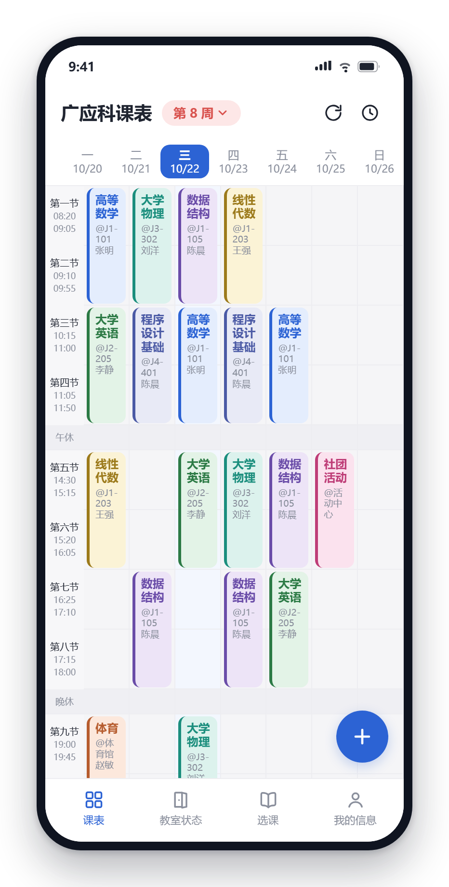
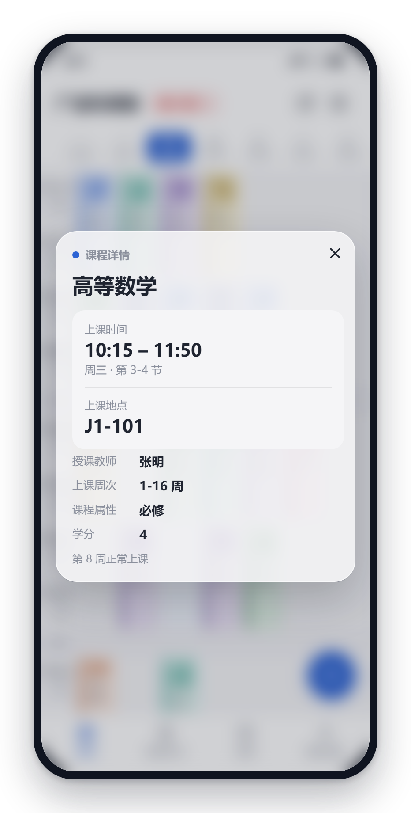
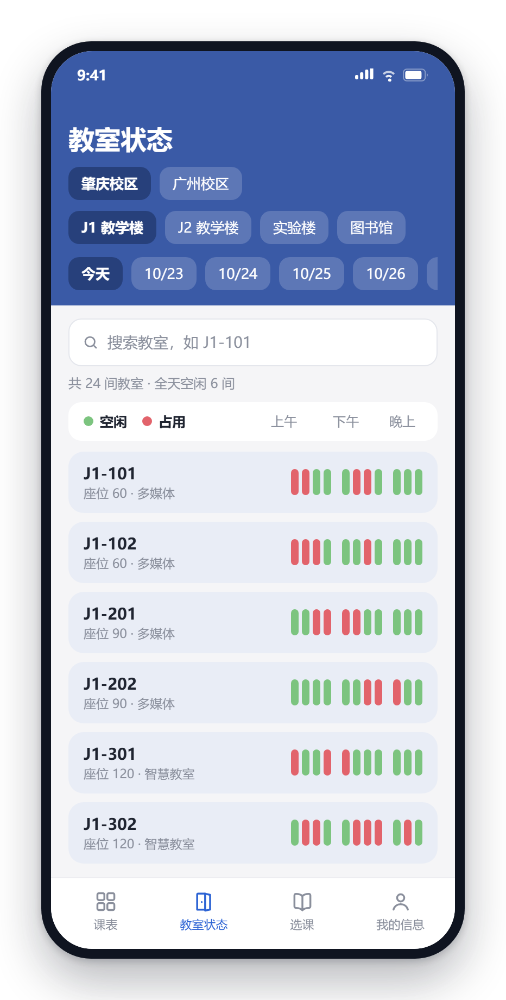
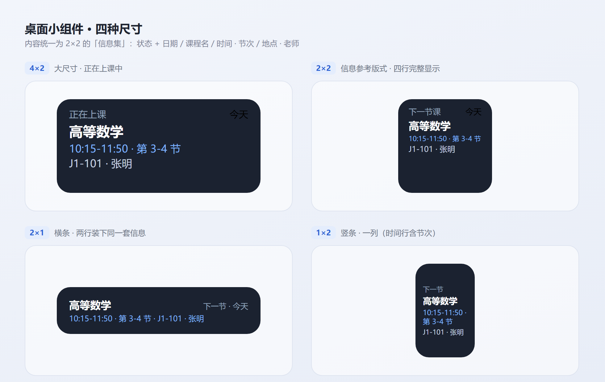
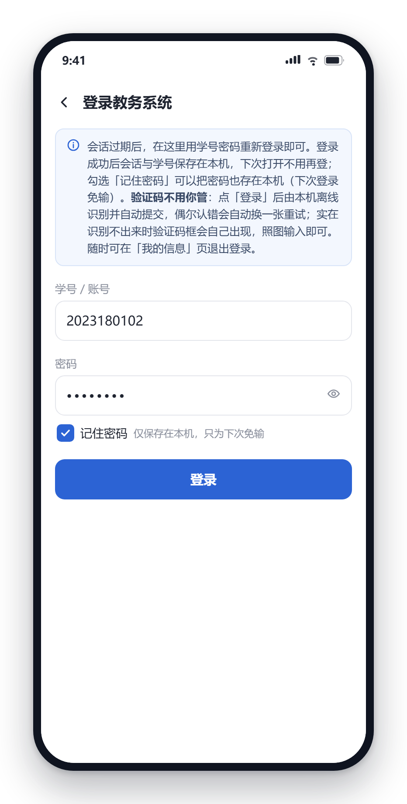
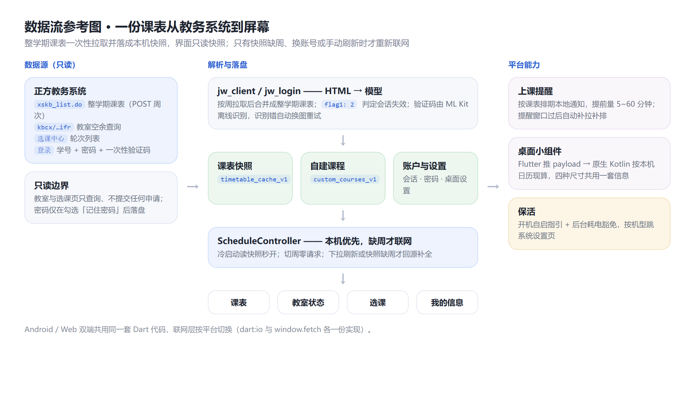

<div id="top"></div>

<!-- 项目 SHIELDS -->
[![Contributors][contributors-shield]][contributors-url]
[![Forks][forks-shield]][forks-url]
[![Stargazers][stars-shield]][stars-url]
[![Issues][issues-shield]][issues-url]
[![Release][release-shield]][release-url]
[![Platform][platform-shield]][release-url]

<!-- 项目 LOGO 与简介 -->
<br />
<div align="center">
  <a href="https://github.com/WM-wuming/Class-schedule">
    
  </a>

  <h3 align="center">广应科课表</h3>

  <p align="center">
    用 <b>Flutter + forui</b> 写的课程表 App：从正方教务系统把整学期课表一次性拉下来、落成本机快照，
    之后切周翻页零请求；桌面小组件、上课提醒、教室查询与自建课程都是它的一部分。
    <br />
    <a href="#软件功能"><strong>浏览功能 »</strong></a>
    <br />
    <br />
    <a href="https://github.com/WM-wuming/Class-schedule/releases">下载 APK</a>
    ·
    <a href="https://github.com/WM-wuming/Class-schedule/issues">反馈 Bug</a>
    ·
    <a href="https://github.com/WM-wuming/Class-schedule/issues">请求新功能</a>
  </p>
</div>

<br />

<!-- 界面速览 -->
<p align="center">
  
  
  
  <br />
  <sub>课表 · 课程详情（液态玻璃弹层）· 教室状态</sub>
</p>

<!-- 目录 -->
<details>
  <summary>目录</summary>
  <ol>
    <li>
      <a href="#软件功能">软件功能</a>
      <ul>
        <li><a href="#课表">课表</a></li>
        <li><a href="#课程">课程</a></li>
        <li><a href="#上课提醒与保活">上课提醒与保活</a></li>
        <li><a href="#登录与账号">登录与账号</a></li>
        <li><a href="#查询只读">查询（只读）</a></li>
        <li><a href="#界面质感">界面质感</a></li>
      </ul>
    </li>
    <li><a href="#数据是怎么流的">数据是怎么流的</a></li>
    <li>
      <a href="#开始">开始</a>
      <ul>
        <li><a href="#依赖">依赖</a></li>
        <li><a href="#安装">安装</a></li>
        <li><a href="#构建">构建</a></li>
        <li><a href="#安卓构建配置要点">安卓构建配置要点</a></li>
        <li><a href="#国内网络绕行">国内网络绕行</a></li>
      </ul>
    </li>
    <li><a href="#使用方法">使用方法</a></li>
    <li><a href="#路线图">路线图</a></li>
    <li><a href="#贡献">贡献</a></li>
    <li><a href="#许可证">许可证</a></li>
    <li><a href="#联系我们">联系我们</a></li>
    <li><a href="#致谢">致谢</a></li>
  </ol>
</details>

## 关于本项目

课表类 App 市面上不少，但它们要么要你自己一格一格地把课敲进去，要么一打开就在转圈等网络。
这个项目想解决的是另一个问题：**教务系统本来就有全学期的课表，App 只是把它搬到你眼前**——
所以它把整学期的课表一次性拉下来、合并成一份 JSON 快照存在本机，界面只读快照。
结果是冷启动先出课表、切任何一周都是零请求，只有快照缺周、换了账号或者你手动下拉刷新时才重新联网。

顺手把「课表之外」的几件事也做了：

* **桌面小组件**：锁屏之外抬头就能看见「下一节课 / 正在上课」，四种尺寸随便摆
* **上课提醒**：跟着课表自己排期，提前量 5~60 分钟可调，还能申请绕过勿扰
* **教室状态**：按日期查哪间教室空着（红绿小条一览），点进去看每节课在上什么课
* **自建课程**：教务系统里没有的课（自习、社团、调课）自己加，刷新/换账号都不会被冲掉

它是为「广应科（广州应用科技学院）」的正方教务系统写的，但教务接口、解析与界面是分开的，
换成同款正方系统的学校，改数据源即可。

<p align="right">(<a href="#top">返回顶部</a>)</p>

### 构建工具

主要框架与库，附加组件在「致谢」一节。

* [Flutter](https://flutter.dev)（Dart `^3.13.4`）+ [forui](https://forui.dev) `^0.26`（界面外壳）
* [flutter_local_notifications](https://pub.dev/packages/flutter_local_notifications) + [timezone](https://pub.dev/packages/timezone)（上课提醒）
* [google_mlkit_text_recognition](https://pub.dev/packages/google_mlkit_text_recognition)（验证码本机离线识别）
* [shared_preferences](https://pub.dev/packages/shared_preferences)（课表快照 / 自建课程 / 账户落盘）
* [web](https://pub.dev/packages/web)（Web 端用 `window.fetch` 调教务系统）
* 原生侧：Kotlin 桌面小组件、`MethodChannel` 让「响铃」绕过勿扰

<p align="right">(<a href="#top">返回顶部</a>)</p>

## 软件功能

### 课表

* 四页主框架：**课表 / 教室状态 / 选课 / 我的信息**（底部导航，Web 端支持 hash 直达）
* **整学期总课表本地化**：用课表接口逐周拉取后合并成 JSON 快照落盘；冷启动先读快照，
  切任何一周都从本地加载、秒开零请求；快照缺周、登录新账号或下拉刷新时才重新联网补全
* 节次网格自绘：周日→周六表头、节次时间轴、**午休/晚休分隔行**、彩色课程卡片（按课程名稳定取色）、今天高亮
* 左右滑动翻周、周次胶囊直接跳周/回到本周、相邻周自动预取、连续快滑防抖（最多 3 个请求）
* 网格随系统字号等比缩放（0.85~1.6 限幅）；设置里可选显示周末/教师/节次时间、淡化非本周课程
* 右上角刷新按钮一键重新拉课表；加载失败降级为提示条
* **「放假啦」彩蛋**：滑到学期最后一周再往后翻出现放假页，再翻回第 1 周

<p align="center">
  
</p>

### 课程

* **点课程弹居中玻璃卡详情**：上课时间（钟点区间）、地点、教师、周次、属性/学分、本周是否上课
* **自建课程**：右下角加号添加教务系统里没有的课（自习/社团/调课），可编辑删除；
  参与提醒、小组件与课时统计；刷新/换账号/退出登录都不动它

<p align="center">
  
</p>

### 上课提醒与保活

* **上课提醒**：总开关 + 提前量（5~60 分钟），通知随课表排期（覆盖式重排、内容没变不碰闹钟、过点不补发）；
  提醒窗口过后打开 App 会**自动往下拉新课表补排提醒**；响铃可申请绕过勿扰（渠道 + 勿扰授权两级兜底）
* **保活栏目**：开机自启指引（按机型跳系统设置）+ 后台耗电限制取消分步指引（申请电池优化白名单）
* **桌面小组件**：四种尺寸（大 4×2 / 方形 2×2 / 横条 2×1 / 竖条 1×2），内容统一为
  「状态+日期 / 课程名 / 时间·节次 / 地点·老师」；只显示**今天**的课，今天没课就明说「今天没有课了」；
  课表变化即时推、节次边界闹钟换内容、30 分钟兜底轮询

<p align="center">
  
</p>

### 登录与账号

* 应用内**登录教务系统**：学号 + 密码 + 验证码；**验证码本机离线识别（ML Kit）、自动填入并自动提交，
  识别错了自动换图重试（最多 3 次）**，也可手动输入兜底；验证码失败自动换图、失败原因保留；
  **记住密码**可选项（本机私有空间，下次免输密码）；退出登录二次确认并清空一切
* 冷启动发现会话失效会**自动重新登录**（存过密码且本次进程只尝试一次）
* 我的信息页展示姓名/学号/院系/专业/班级（与当前周次同一响应，零额外请求）
* 周次与开学日期按教务系统主页面自动校准，学期兜底值可被纠正

<p align="center">
  
</p>

### 查询（只读）

* **教室详细**：按日期/校区/教学楼查教室占用一览（红绿小条，按上午/下午/晚上分组），
  点教室弹出当天每节课的上课班级与空闲时段
* **选课**：学生选课中心的轮次列表（只读，不提交志愿）

<p align="center">
  
</p>

### 界面质感

* 全部底部弹层与居中弹窗统一**液态玻璃**质感：弹层本体毛玻璃卡，弹出时整个背景磨砂模糊+轻压暗（动画跟随）
* 沉浸式 edge-to-edge：页面头部延伸到状态栏底下，状态栏图标随页面深浅自动变色
* Windows/Linux 桌面端自动注入中文字体（forui 默认字体没有中文字形）

<p align="right">(<a href="#top">返回顶部</a>)</p>

## 数据是怎么流的



<p align="right">(<a href="#top">返回顶部</a>)</p>

## 开始

下面是把它跑起来的步骤。

### 依赖

| 组件 | 要求 |
| --- | --- |
| Flutter SDK | ≥ 3.38（Dart SDK `^3.13.4`，见 `pubspec.yaml`） |
| JDK | 17+ |
| Android SDK | `compileSdk` 36 / `build-tools` 36.0.0 / platform-tools，`ANDROID_HOME` 指向 SDK 根目录 |
| 运行平台 | Android 7.0+（`minSdkVersion` 24）；Web 端需配合同源网关（`tool/jw_proxy.dart`） |
| 可选 | Microsoft Edge 或 Chrome —— 只有重新生成 README 配图时才需要 |

### 安装

1. 克隆本仓库
   ```sh
   git clone git@github.com:WM-wuming/Class-schedule.git
   cd Class-schedule
   ```
2. 拉依赖
   ```sh
   flutter pub get
   ```
3. 接一台设备（或起模拟器）跑起来
   ```sh
   flutter run
   ```
4. 首次打开进「我的信息 → 登录」，用学号密码登一次教务系统，课表就会自己拉下来

### 构建

```powershell
flutter test                      # 全部测试（联网实测默认跳过）

# Android APK（需先设置 SDK 路径）
$env:ANDROID_HOME='D:\pata'; $env:ANDROID_SDK_ROOT='D:\pata'
flutter build apk --release       # → build\app\outputs\flutter-apk\app-release.apk

# Web（附带跨域解决方案）
flutter build web --release
dart run tool/jw_proxy.dart       # 打开 http://127.0.0.1:8765/
```

推 `v*` 标签会触发 `.github/workflows/release.yml`，自动构建 Android 签名 APK、iOS 未签名 IPA、
Windows zip 并创建 Release。

### 安卓构建配置要点

| 项 | 值 | 说明 |
| --- | --- | --- |
| `minSdkVersion` | 24 | Android 7.0+ |
| `targetSdkVersion` | 36 | 面向新系统优化，不影响老设备运行 |
| native-code | arm64-v8a / armeabi-v7a / x86_64 | 覆盖主流真机与模拟器 |
| 网络 | 仅 HTTPS | Android 9 默认禁止明文 HTTP，本项目只访问 `https://` 教务系统 |
| 签名 | 自备 release 密钥库 | `android/key.properties` + `android/release-keystore.jks`（均已 gitignore）；缺失时退回 debug 签名 |

`flutter_local_notifications` 要求宿主也开 **core library desugaring**，缺了会报
`:app:checkReleaseAarMetadata` 失败，`android/app/build.gradle.kts` 里两处缺一不可：

```kotlin
android {
    compileOptions {
        isCoreLibraryDesugaringEnabled = true
        // ...
    }
}

dependencies {
    coreLibraryDesugaring("com.android.tools:desugar_jdk_libs:2.1.4")
}
```

上课提醒相关权限（都在 `android/app/src/main/AndroidManifest.xml`，改完务必用
`aapt2 dump badging` 复核）：`POST_NOTIFICATIONS`（13+ 运行时申请）、
`SCHEDULE_EXACT_ALARM`（准点响，拿不到退化成不精确排期）、`RECEIVE_BOOT_COMPLETED`（重启后重新登记提醒），
以及 `flutter_local_notifications` 要求显式声明的两个 `exported=false` 接收器
（`ScheduledNotificationReceiver` / `ScheduledNotificationBootReceiver`）。

### 国内网络绕行

1. **pub 依赖走国内镜像**：
   ```powershell
   $env:PUB_HOSTED_URL='https://pub.flutter-io.cn'
   $env:FLUTTER_STORAGE_BASE_URL='https://storage.flutter-io.cn'
   ```
2. **Gradle 依赖走阿里云**：`~/.gradle/init.gradle`（init 脚本用 `beforeSettings` 注入
   `pluginManagement` 镜像并加到每个 project，`repositoriesMode` 设为 `PREFER_PROJECT`）。
3. **Gradle 发行版走腾讯镜像**：`android/gradle/wrapper/gradle-wrapper.properties`
   已改为 `https://mirrors.cloud.tencent.com/gradle/gradle-9.3.1-all.zip`。
4. **关掉 AGP 自动下载 SDK 组件**：`android/gradle.properties` 里
   `android.builder.sdkDownload=false`，缺组件时立刻报错指出包名，按提示从镜像装即可。

其它工程约定（Gradle 侧）：`kotlin.incremental=false`（跨盘符增量编译会崩，勿删）。
冷编译约 10 分钟，之后改 Dart 代码再打包约 1 分钟。

<p align="right">(<a href="#top">返回顶部</a>)</p>

## 使用方法

* **翻周**：课表页左右滑动；点标题旁的「第 N 周」胶囊可以直接跳到某一周或回到本周
* **看课程详情**：点任意一张课程卡片
* **加自己的课**：课表右下角 `+`，填课程名、星期、节次、地点、教师、周次范围、颜色来自动取色
* **今天的课**：课表右上角时钟图标，弹出「今天 · 周X · 第 N 周」的清单
* **刷新课表**：课表右上角刷新图标，或下拉（冷启动读快照，刷新才联网）
* **教室状态**：选校区/教学楼/日期 → 看红绿占用条 → 点教室看每节课的班级与空闲时段
* **上课提醒**：设置 → 上课提醒，打开开关并选提前量；想让它绕过勿扰，按页面上的黄色提示卡去系统里放行
* **桌面小组件**：长按桌面 → 小组件 → 找到「广应科课表」→ 选四种尺寸之一丢到桌面上
* **保活**：设置 → 保活，按机型指引开自启动、放开后台耗电限制

### 重新生成 README 里的配图

`README.md` 里的界面图不是截屏，而是 `tool/readme-images/` 下的一套手写 HTML 界面稿：
尺寸与配色直接从 `lib/theme/course_palette.dart`、`lib/widgets/timetable_grid.dart`、
`lib/screens/*.dart`、`android/app/src/main/res/layout/next_class_widget*.xml` 里搬过来，
所以改界面时顺手改这里，图就跟着更新（不会出现「截图是三个版本前的界面」）。

```powershell
powershell -ExecutionPolicy Bypass -File tool\readme-images\render.ps1
```

脚本用无头 Edge（或 Chrome）按 2 倍像素密度渲染，产物写到 `images/`，手机截图带透明外框。

<p align="right">(<a href="#top">返回顶部</a>)</p>

## 路线图

- [x] 整学期课表快照本地化（切周零请求）
- [x] 验证码本机离线识别 + 自动提交闭环
- [x] 冷启动会话失效自动重登
- [x] 桌面小组件四种尺寸，统一「今天的课」口径
- [x] 上课提醒（含勿扰豁免与渠道预建）
- [x] 教室状态按日期查询 + 快速连点防串台
- [ ] 修掉部分真机上验证码识别静默失效的问题
- [ ] iOS 侧适配与打包
- [ ] Windows 桌面端签名安装包
- [ ] 深色主题
- [ ] 多学校适配（教务接口可插拔）

到 [open issues](https://github.com/WM-wuming/Class-schedule/issues) 页查看所有请求的功能（以及已知的问题）。

<p align="right">(<a href="#top">返回顶部</a>)</p>

## 贡献

贡献让开源社区成为一个非常适合学习、启发和创新的地方。你所做出的任何贡献都是**受人尊敬**的。

如果你有好的建议，请复刻（fork）本仓库并且创建一个拉取请求（pull request）。
你也可以简单地创建一个议题（issue），并且添加标签「enhancement」。不要忘记给项目点一个 star！再次感谢！

1. 复刻（Fork）本项目
2. 创建你的 Feature 分支 (`git checkout -b feature/AmazingFeature`)
3. 提交你的变更 (`git commit -m 'Add some AmazingFeature'`)
4. 推送到该分支 (`git push origin feature/AmazingFeature`)
5. 创建一个拉取请求（Pull Request）

<p align="right">(<a href="#top">返回顶部</a>)</p>

## 许可证

本仓库**未附带开源许可证文件**，默认保留所有权利：代码仅作学习与交流参考，
未经作者许可请勿再分发或用于商业用途。如需在其它场景使用，欢迎开 issue 说明来意。

<p align="right">(<a href="#top">返回顶部</a>)</p>

## 联系我们

WM-wuming（[@GitHub](https://github.com/WM-wuming)）

项目链接: [https://github.com/WM-wuming/Class-schedule](https://github.com/WM-wuming/Class-schedule)

<p align="right">(<a href="#top">返回顶部</a>)</p>

## 致谢

* [forui](https://forui.dev) —— 界面外壳，液态玻璃弹层与所有控件都出自它
* [Lucide Icons](https://lucide.dev) —— 图标
* [flutter_local_notifications](https://pub.dev/packages/flutter_local_notifications) —— 上课提醒的排期与渠道
* [ML Kit Text Recognition](https://developers.google.com/ml-kit) —— 验证码离线识别
* [Img Shields](https://shields.io) —— 顶部的徽章
* [Best-README-Template-zh](https://github.com/BreakingAwful/Best-README-Template-zh) —— 本 README 的版式模板
* [正方教务系统](https://www.zfsoft.com) —— 数据来源（本项目仅做只读访问）

<p align="right">(<a href="#top">返回顶部</a>)</p>

<!-- MARKDOWN 链接 & 图片 -->
<!-- https://www.markdownguide.org/basic-syntax/#reference-style-links -->
[contributors-shield]: https://img.shields.io/github/contributors/WM-wuming/Class-schedule.svg?style=for-the-badge
[contributors-url]: https://github.com/WM-wuming/Class-schedule/graphs/contributors
[forks-shield]: https://img.shields.io/github/forks/WM-wuming/Class-schedule.svg?style=for-the-badge
[forks-url]: https://github.com/WM-wuming/Class-schedule/network/members
[stars-shield]: https://img.shields.io/github/stars/WM-wuming/Class-schedule.svg?style=for-the-badge
[stars-url]: https://github.com/WM-wuming/Class-schedule/stargazers
[issues-shield]: https://img.shields.io/github/issues/WM-wuming/Class-schedule.svg?style=for-the-badge
[issues-url]: https://github.com/WM-wuming/Class-schedule/issues
[release-shield]: https://img.shields.io/github/v/release/WM-wuming/Class-schedule.svg?style=for-the-badge
[release-url]: https://github.com/WM-wuming/Class-schedule/releases
[platform-shield]: https://img.shields.io/badge/platform-Android%20%7C%20Web-2C63D4.svg?style=for-the-badge&logo=flutter&logoColor=white
